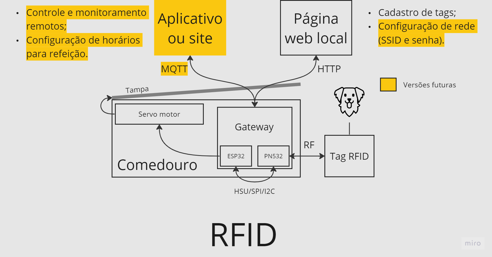
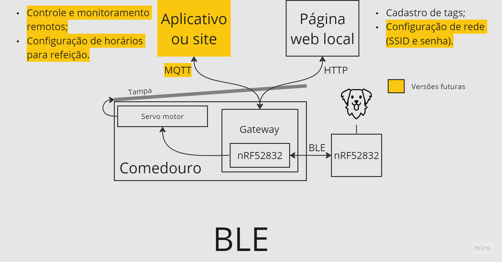

# Comedouro por proximidade - PetDog

Repositório para material relacionado ao projeto de comedouro com tampa acionada por proximidade. Projeto desenvolvido a pedido da empresa [PetDog](https://petdogalimentos.com.br).

# Componentes

## Hardware

- Kit de desenvolvimento ESP32-WROOM-32D
- Módulo RFID PN532 com suporte a NFC
- Servo motor Tower Pro MG995
- Tag RFID 13,56 MHz

## Software

- ESP-IDF (framework de desenvolvimento de soluções IoT para produtos da Espressif)
- FreeRTOS (Sistema operacional de tempo real, incluso no ESP-IDF)

# Funcionamento geral

Atualmente, o funcionamento geral do sistema deve ocorrer por RFID (*Radio Frequency Identification*), conforme mostra a imagem a seguir:

Entretanto, uma outra possibilidade foi levantada durante as discussões do projeto, que envolve o uso de BLE (*Bluetooth Low Energy*) no lugar de RFID, conforme ilustrado abaixo:

# Requisitos

## Requisitos funcionais

- ESP32 deve gerar uma página web local para que o usário seja capaz de cadastrar a tag do seu cachorro.
- Quando uma tag cadastrada chegar perto do módulo PN532, o servo motor deve ser acionado e a tampa do comedouro deve ser aberta.
- Enquanto a tag estiver próxima, a tampa deve permanecer aberta.
- Após a tag sair de perto do módulo PN532, a tampa do comedouro deve ser fechada.
- Quando uma tag não cadastrada se aproximar, a tampa deve permanecer fechada.
- ESP32 deve salvar em memória flash (NVS) informações necessárias para que o usuário cadastre a tag apenas uma vez.

## Requisitos não funcionais

- A tag deve precisar ser cadastrada uma vez só, sem a necessidade de cadastrar novamente em caso de desligamento.

# Links

- [Quadro do projeto no Miro (visualização)](https://miro.com/app/board/uXjVMkIKjfA=/?share_link_id=717268011685)
- [Quadro do projeto no Miro (dev)](https://miro.com/app/board/uXjVMkIKjfA=/?share_link_id=29421162542)